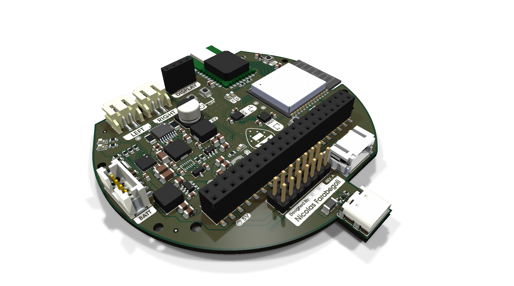

# Dropbot Circuit Board

## Scope of the Board

The Rover Circuit is a comprehensive controller board designed for robotics applications, specifically targeted at robot rovers. A key goal of this project is to make swarm robotics accessible to students, educators, and researchers, providing an affordable and easy-to-use platform for experimenting with multi-agent systems and decentralized control. 

It integrates dual-motor driving capabilities, 2-cell Li-ion battery management with USB-C charging, and provides multiple power domains (3.3V, 5V, 6V) for logic, sensors, and external compute modules like a Raspberry Pi. The board includes I2C and GPIO interfaces to facilitate communication with various sensors and control systems, making it a compact, all-in-one hardware platform for mobile robot development.

## Main Components & Features

* **Espressif ESP32-C6 (Microcontroller)**: The core processing unit of the board, offering Wi-Fi 6, Bluetooth LE, and IEEE 802.15.4 (Zigbee/Thread) connectivity. Its robust wireless capabilities are ideal for inter-robot communication in a swarm network.
* **Decawave DWM1000 (UWB Module)**: An Ultra-Wideband transceiver module designed for precise indoor localization, spatial awareness, and ranging between rovers. Crucial for coordinated swarm movements and mapping.
* **9-DOF Inertial Measurement Unit (IMU)**: 
  * *Bosch BMI270*: A 6-axis accelerometer and gyroscope for tracking movement and rotation.
  * *MEMSIC MMC5983MA*: A high-precision 3-axis magnetometer acting as a digital compass for absolute heading orientation.
* **TI BQ25887 (Battery Management)**: A 2-cell Li-ion boost-mode battery charger with integrated cell balancing and USB-C input support. It handles safe charging and power management for the entire rover.
* **TI DRV8833 (Motor Driver)**: A dual H-bridge motor driver capable of delivering 1.5A RMS per bridge. It is used to independently drive two DC motors (such as N20 motors) for locomotion.
* **STM6601 (Power Controller)**: A smart push-button on/off controller for robust hardware power management and user interaction.
* **Power Distribution System**: Dedicated voltage regulators generating 3.3V for internal logic and sensors, 6V for the motors, and a clean 5V output.
* **SBC Expansion & User Interface**: An expansion header capable of powering and interfacing with a Single Board Computer (e.g., Raspberry Pi) over 5V, along with a dedicated I2C connector for attaching an OLED display module.

These components work together to provide a complete, robust sensing, processing, and locomotion backend, allowing developers to focus on high-level swarm robotics software and decentralized algorithms without worrying about hardware integration.

## Sponsors

---

## License

MIT License - see LICENSE file for details.
